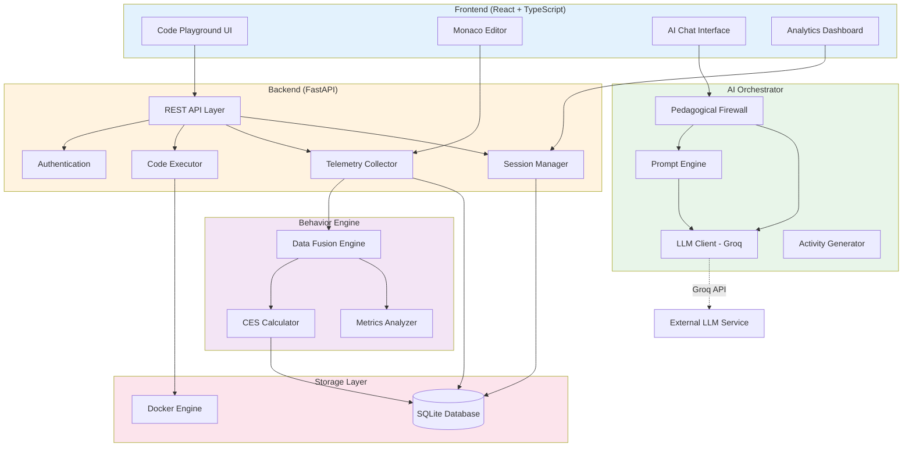
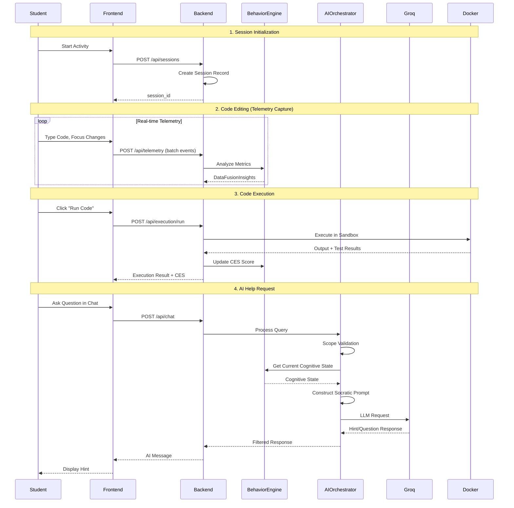
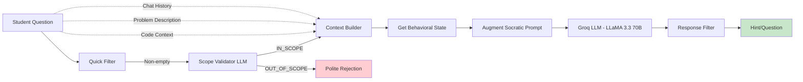

# rbAI 

A pedagogical AI system for teaching novice programmers algorithmic problem-solving through behavioral monitoring, intelligent scaffolding, and Socratic tutoring.

## Table of Contents

- [Project Overview](#project-overview)
- [System Architecture](#system-architecture)
- [Core Behavioral System Logic](#core-behavioral-system-logic)
- [AI Guidance / Cognitive Design](#ai-guidance--cognitive-design)
- [Tech Stack](#tech-stack)
- [Setup & Installation](#setup--installation)
- [Project Structure](#project-structure)
- [API Documentation](#api-documentation)

---

## Project Overview

### Problem Statement

Novice programmers learning algorithmic problem-solving often struggle with:
- Over-reliance on AI for direct solutions rather than learning
- Lack of structured guidance that promotes critical thinking
- Absence of behavioral feedback on coding practices
- Difficulty detecting disengagement or academic dishonesty

Generic AI coding assistants (e.g., ChatGPT, Copilot) provide complete solutions, undermining the learning process for beginners.

### System Purpose

rbAI is an **educational programming environment** specifically designed for **Novice Programming students**. The system:

1. **Monitors Behavioral Patterns**: Captures fine-grained telemetry (keystrokes, idle time, execution activity, code changes, focus violations) to understand student engagement
2. **Quantifies Cognitive Engagement**: Uses a multi-dimensional scoring algorithm (CES) to classify authentic learning vs. surface-level activity
3. **Provides Socratic Tutoring**: AI guidance through hints and questions rather than direct solutions
4. **Validates Learning Integrity**: For now, it detects copy-paste behavior. It also have a supporting guardrail for "spamming" event to prevent extreme metric validation.

### Target Users

- **Students**: Novice programmers
- **Instructors**: Educators who create activities and monitor student engagement/progress
- **Researchers**: Those studying educational AI, behavioral analytics, or pedagogical interventions

### Design Philosophy

**Scaffolding > Solutions**: The system is designed to guide learning, not replace thinking. Key principles:

- **No Direct Code Generation**: AI never writes solutions for students
- **Context-Aware Pedagogy**: Responses adapt based on behavioral state (e.g., more encouragement when disengaged)
- **Evidence-Based Metrics**: All thresholds calibrated for novice programmers solving short-form problems
- **Transparency**: Students see their engagement metrics (CES score, behavioral flags) to build metacognitive awareness

Unlike generic AI chatbots, rbAI enforces:
- **Scope Constraints**: Only answers questions about the current problem
- **Language Enforcement**: English-only (for academic integrity in multilingual contexts)
- **Pedagogical Guardrails**: Refuses requests like "write the code for me" or "give me the answer"

---

## System Architecture

### High-Level Architecture



### Component Breakdown

#### 1. Frontend Layer (React + TypeScript)
- **Code Playground**: Monaco editor with syntax highlighting, test runner, problem statement viewer
- **AI Chat Interface**: Contextual help requests with conversation history
- **Analytics Dashboard**: Instructor view of student sessions, CES scores, behavioral flags
- **Telemetry Instrumentation**: Captures keystroke events, focus changes, idle detection in real-time

#### 2. Backend API Layer (FastAPI)
- **Authentication**: JWT-based (assumed, using bcrypt for password hashing)
- **Session Management**: Tracks active coding sessions with activity context
- **Code Execution**: Docker-based sandboxed Python runner (5s timeout, 128MB memory limit)
- **Telemetry Collection**: Real-time event ingestion with timestamp precision

#### 3. Behavior Engine
- **Data Fusion Engine**: Contextualizes raw telemetry into pedagogical states (Provenance, Cognitive)
- **CES Calculator**: Computes Cognitive Engagement Score (-1.0 to 1.0) using weighted metrics
- **Metrics Analyzer**: Aggregates session-level statistics (KPM, AD, IR, FVC)

#### 4. AI Orchestrator
- **Pedagogical Firewall**: Scope validation, prompt construction, response filtering
- **Prompt Engine**: Template-based system with state-specific augmentations
- **LLM Client**: Groq API wrapper (LLaMA-3.3-70b-versatile) with token budget management
- **Activity Generator**: Uses LLM function calling to create structured coding activities

#### 5. Storage Layer
- **SQLite Database**: Relational schema for users, activities, sessions, telemetry events, CES scores
- **Docker Engine**: Isolated Python 3.10-alpine containers for code execution

### Data Flow: User Interaction to AI Response



### Separation of Concerns

| Layer | Responsibility | Does NOT Handle |
|-------|---------------|-----------------|
| **Frontend** | UI interaction, event capture, rendering | Business logic, AI decisions |
| **Backend API** | Request routing, validation, orchestration | Direct AI prompting, CES calculation |
| **Behavior Engine** | Telemetry analysis, state classification | Chat responses, code execution |
| **AI Orchestrator** | Prompt engineering, LLM communication | Behavioral scoring, session management |
| **Storage** | Data persistence, query execution | Application logic |

---

## Core Behavioral System Logic

The Behavior Engine is the heart of rbAI's educational diagnostics. It transforms raw telemetry into actionable pedagogical insights.

### Telemetry Capture

**Events Tracked**:
- `keystroke`: Character insertions/deletions in the editor
- `focus` / `blur`: Window/tab switches (potential academic integrity concern)
- `idle_start` / `idle_end`: Periods of inactivity (differentiated between thinking vs. disengagement)
- `run`: Code execution attempts
- `submit`: Final solution submission
- `paste`: Clipboard paste operations

**Captured Context** (per event):
- Timestamp (millisecond precision)
- Editor state (line count, character count, cursor position)
- Code snapshot (for runs/submits)
- Diff analysis (insertions, deletions, semantic changes) (hallucinated)

### Data Fusion Engine

Implements multi-dimensional behavioral analysis to contextualize raw metrics:

#### 1. Provenance & Authenticity Analysis

**Detects**:
- **Authentic Refactoring**: Normal incremental edits (<30 chars)
- **Ambiguous Large Edit**: 30-50 char insertions with uncertain provenance
- **Suspected External Paste**: >50 chars + low keystroke density + focus violations
- **Spamming**: High keystroke count (>200) with low efficiency ratio (<0.05)

**Algorithm**:
```
IF last_edit_size > 30 chars:
    IF keystroke_to_insertion_ratio < 0.2 
       AND focus_violations > 0 
       AND edit_size > 50:
        → SUSPECTED_PASTE (integrity_penalty = 0.5)
    ELIF keystroke_to_insertion_ratio > 0.8:
        → AUTHENTIC_REFACTORING
    ELSE:
        → AMBIGUOUS_EDIT

IF total_keystrokes > 200 AND net_code_change / keystrokes < 0.05:
    → SPAMMING
```

**Thresholds Calibration**:
- **30 chars**: Represents 6-12% of typical novice solution (250-500 chars)
- **0.2 ratio**: Keystroke density threshold for manual typing vs. paste
- **0.05 efficiency**: Minimum productive output ratio for novices

#### 2. Cognitive State Classification

**Detects**:
- **Active**: Normal coding flow (idle < 30s)
- **Reflective Pause**: Post-error deliberation (30-120s idle + recent error)
- **Passive Idle**: Extended inactivity without error context (30-120s idle)
- **Disengagement**: Sustained absence (>120s idle)

**Algorithm**:
```
IF current_idle < 30s:
    → ACTIVE
ELIF 30s <= current_idle <= 120s:
    IF last_run_error AND is_window_focused:
        → REFLECTIVE_PAUSE (not penalized in CES)
    ELSE:
        → PASSIVE_IDLE (penalized in CES)
ELIF current_idle > 120s:
    → DISENGAGEMENT (heavily penalized)
```

**Rationale**:
- Novices need 30-120s to parse error messages and plan corrections
- Differentiating valid deliberation from distraction is critical for fair assessment
- >120s exceeds typical "thinking time" even for difficult problems

### CES (Cognitive Engagement Score) Calculation

**Purpose**: Quantify authentic learning engagement on a scale of -1.0 (disengaged) to 1.0 (highly engaged).

#### Metric Components

| Metric | Description | Range | Weight |
|--------|-------------|-------|--------|
| **KPM** | Keystrokes Per Minute | 5.0 - 24.0 | 35% |
| **AD** | Attempt Density (runs/min) | 0.05 - 0.50 | 25% |
| **FVC** | Focus Violation Count | 0 - 10 | 25% |
| **IR** | Idle Ratio (idle_time / total_time) | 0.0 - 0.60 | 15% |


#### Threshold Justification

- **KPM (5.0 - 24.0)**: 
  - Lower bound: Minimum demonstrable typing activity for novices
  - Upper bound: Exceeds realistic sustained manual entry for reflective problem-solving
  
- **AD (0.05 - 0.50)**:
  - Lower bound: 1 run per 20 minutes (below this = lack of iterative testing)
  - Upper bound: 1 run per 2 minutes (above this = excessive trial-and-error)
  
- **IR (0.0 - 0.60)**:
  - Maximum tolerable idle time is 60% of session (reflective pauses excluded by Data Fusion)
  
- **FVC (0 - 10)**:
  - Capped at 10 violations to prevent outlier skewing

#### Calculation Formula

```python
# Normalize each metric to [0, 1]
kpm_norm = normalize(effective_kpm, 5.0, 24.0)
ad_norm = normalize(effective_ad, 0.05, 0.50)
ir_norm = normalize(effective_ir, 0.0, 0.60)
fvc_norm = normalize(fvc, 0, 10)

# Productive vector (positive contribution)
productive_score = (0.35 * kpm_norm) + (0.25 * ad_norm)

# Disengagement vector (negative contribution)
penalty_score = (0.15 * ir_norm) + (0.25 * fvc_norm)

# Net engagement with integrity penalty
ces = productive_score - penalty_score - integrity_penalty

# Clamp to [-1.0, 1.0]
ces = clamp(ces, -1.0, 1.0)
```

#### Classification Labels

| CES Range | Label | Interpretation |
|-----------|-------|----------------|
| 0.60 - 1.00 | High Engagement | Strong authentic effort |
| 0.20 - 0.59 | Moderate Engagement | Acceptable learning activity |
| -0.20 - 0.19 | Low Engagement | Minimal productive work |
| -1.00 - -0.21 | Disengaged | Little to no learning activity |

### Behavioral Flags

Automatically generated warnings for instructors:

- **is_spamming**: Efficiency ratio < 0.05 (random key-mashing)
- **is_suspected_paste**: Copy-paste indicators present
- **is_disengagement**: Idle time > 120s

---

## AI Guidance / Cognitive Design

### Design Philosophy: Scaffolding, Not Solutions

rbAI's AI system is **fundamentally different from generic coding assistants**:

| Generic AI (ChatGPT, Copilot) | rbAI Pedagogical Firewall |
|-------------------------------|---------------------------|
| Provides complete solutions | Refuses direct solutions |
| Answers any question | Enforces scope constraints |
| Language-agnostic | English-only for academic integrity |
| Context-unaware | Adapts to behavioral state |
| No learning goals | Explicitly pedagogical |

### Pedagogical Firewall Architecture



### Prompt Engineering Principles

#### 1. System Prompt Structure

**Core Guardrails**:
```
You are an AI programming tutor for educational purposes.

LANGUAGE ENFORCEMENT:
- ONLY respond to queries in English
- If asked in Filipino/Tagalog/Spanish, respond: "I can only help with questions in English."
- Do NOT answer even if you understand

SCOPE ENFORCEMENT:
- ONLY help with the current programming problem
- Cannot help with: unrelated topics, other homework, general programming outside current problem
- Out-of-scope response: "I can only help with the current programming activity."

PEDAGOGICAL RULES:
- NEVER provide complete solutions or final code
- NEVER write code for the student
- Guide with hints, questions, explanations
- Ask Socratic questions to help students think
- If "give me the answer", respond: "I'm here to help you learn, not solve for you."
```

#### 2. Context Injection

**Provided to LLM**:
- **Problem Description**: The algorithmic problem statement
- **Current Code**: Student's editor state (for contextual help)
- **Language**: Programming language (currently Python only)
- **Behavioral Context**: Current cognitive state (Active, Reflective Pause, Passive Idle, Disengagement)
- **Chat History**: Last 3-5 messages for conversation continuity

#### 3. State-Specific Augmentations

Dynamic prompt adjustments based on **cognitive state** (intervention-triggering):

| Cognitive State | Prompt Augmentation |
|------------------|---------------------|
| **Disengagement** | "⚠️ Student seems stuck. Ask simple question to re-engage: 'What part are you working on?'" |
| **Passive Idle** | "⚠️ Student may be stalling. Provide gentle nudge: 'What's your next step?'" |
| **Reflective Pause** | "✓ Student is thinking after error. Wait for them to ask, then guide gently." |
| **Active** | "✓ Student is engaged. Use subtle hints through questions." |

**Note:** Only cognitive state is passed to the AI. Provenance state (code authorship patterns) is tracked for CES calculation but not used in prompts.

### Scope Validation

**Two-Stage Filtering**:

1. **Quick Filter** (local, instant):
   - Check for empty queries → reject

2. **LLM Validator** (Groq API call):
   - Determines if query is about:
     - Getting help with algorithmic/coding problems ✓
     - Understanding code concepts, debugging, learning ✓
     - Asking for hints or explanations ✓
   - Response: `IN_SCOPE` or `OUT_OF_SCOPE` (no explanation)

**Example Rejections**:
- "What's the weather today?" → OUT_OF_SCOPE
- "Help me with my math homework" → OUT_OF_SCOPE
- "Write a web scraper for me" → OUT_OF_SCOPE (wrong problem)
- "Ano ang sagot?" (Filipino) → LANGUAGE_VIOLATION

### How This Differs from Generic AI Chatbots

1. **Refuses Direct Solutions**: Will not write complete code even if asked repeatedly
2. **Context-Locked**: Cannot discuss topics outside the current problem
3. **Behaviorally Adaptive**: Responses tailored to engagement state (more encouragement when stuck)
4. **Educational Accountability**: All interactions logged for instructor review
5. **Token-Efficient**: Responses limited to 500 tokens (cost-effective at scale)

### Socratic Tutoring Examples

**Student**: "How do I solve this binary search problem?"

**Generic AI**: *(Provides complete implementation)*

**rbAI**: "Good question! Let's think about it step by step. Binary search works by repeatedly dividing the search space. What condition would you check to decide whether to search the left or right half?"

---

**Student**: "My code doesn't work. Fix it."

**Generic AI**: *(Rewrites the code)*

**rbAI**: "I see you're stuck! Instead of fixing it for you, let's debug together. What error message are you getting? And what do you think that error means?"

---

**Student**: "Ano ang tamang code?" (Filipino: What's the correct code?)

**Generic AI**: *(Answers in Filipino or provides code)*

**rbAI**: "I can only help with questions in English. Please ask your question in English."

---

## Tech Stack

### Backend (Python)

| Component | Technology | Version | Purpose |
|-----------|-----------|---------|---------|
| **Framework** | FastAPI | Latest | High-performance async REST API |
| **ORM** | SQLAlchemy | 2.0+ | Database models and queries |
| **Database** | SQLite | 3 | Embedded relational database |
| **Authentication** | bcrypt | Latest | Password hashing |
| **Rate Limiting** | SlowAPI | Latest | API request throttling |
| **Container Runtime** | Docker SDK | Latest | Sandboxed code execution |
| **LLM Client** | OpenAI SDK | 1.12+ | Groq API integration (OpenAI-compatible) |

**Key Dependencies**:
```toml
fastapi[standard] >= 0.124.2
sqlalchemy >= 2.0.45
bcrypt >= 4.1.2
docker >= 7.1.0
openai >= 1.12.0
slowapi >= 0.1.9
```

### Frontend (TypeScript/React)

| Component | Technology | Version | Purpose |
|-----------|-----------|---------|---------|
| **Framework** | React | 19.2+ | UI component library |
| **Language** | TypeScript | 5.7+ | Type-safe development |
| **Build Tool** | Vite | 7.2+ | Fast dev server and bundler |
| **Router** | React Router | 7.11+ | Client-side routing |
| **Code Editor** | Monaco Editor | 0.55+ | VS Code-based editor (syntax highlighting, IntelliSense) |
| **Charts** | Recharts | 3.6+ | Analytics visualizations |
| **Markdown** | React Markdown | 10.1+ | Problem statement rendering |
| **Styling** | Tailwind CSS | 4.1+ | Utility-first CSS |
| **Icons** | Lucide React | Latest | Icon library |

**Key Dependencies**:
```json
{
  "react": "^19.2.0",
  "@monaco-editor/react": "^4.7.0",
  "react-router-dom": "^7.11.0",
  "recharts": "^3.6.0",
  "react-markdown": "^10.1.0",
  "tailwindcss": "^4.1.17"
}
```

### AI / LLM Services

| Service | Provider | Model | Purpose |
|---------|----------|-------|---------|
| **Primary LLM** | Groq | LLaMA-3.3-70b-versatile | Socratic tutoring, scope validation |
| **Alternative** | Groq | OpenAI GPT-OSS-120B | Higher-quality responses (slower) |
| **API Interface** | OpenAI-compatible | - | Unified client interface |

**Why Groq?**
- **Speed**: Sub-second inference via LPU architecture (vs 2-5s for OpenAI)
- **Cost**: ~90% cheaper than OpenAI for equivalent models
- **OpenAI Compatibility**: Drop-in replacement for OpenAI SDK

### DevOps / Deployment

| Component | Technology | Purpose |
|-----------|-----------|---------|
| **Containerization** | Docker | Service isolation |
| **Orchestration** | Docker Compose | Multi-service management |
| **Reverse Proxy** | (None currently) | Future: Nginx for production |
| **Code Execution** | Docker-in-Docker | Sandboxed Python runner (python:3.10-alpine) |

**Resource Limits** (per service):
- Backend: 256MB RAM, 0.5 CPU
- Frontend: 256MB RAM, 0.5 CPU
- Code Execution Sandbox: 128MB RAM, 0.5 CPU, 5s timeout

---

## Setup & Installation

### Prerequisites

- **Docker**: 20.10+ with Docker Compose V2
- **Node.js**: 18+ (for local frontend development)
- **Python**: 3.10+ (for local backend development)
- **Git**: For cloning the repository
- **Groq API Key**: Free tier available at [console.groq.com](https://console.groq.com)

### Environment Variables

Create a `.env` file in the project root (or export in your shell):

| Variable | Description | Required | Default |
|----------|-------------|----------|---------|
| `GROQ_API_KEY` | Groq API key for LLM access | **Yes** | - |
| `OPENAI_API_KEY` | Alternative OpenAI key (optional) | No | - |
| `DATABASE_PATH` | SQLite database file location | No | `/app/db/rbai.db` |
| `ENVIRONMENT` | Deployment environment | No | `development` |

**Example**:
```bash
GROQ_API_KEY=gsk_xxxxxxxxxxxxxxxxxxxxxxxxxxxx
ENVIRONMENT=development
DATABASE_PATH=/app/db/rbai.db
```

### Quick Start (Docker Compose - Recommended)

1. **Clone the repository**:
   ```bash
   git clone <repository-url>
   cd rbAI
   ```

2. **Set environment variables**:
   ```bash
   # Windows PowerShell
   $env:GROQ_API_KEY="your-groq-api-key"
   
   # Linux/Mac
   export GROQ_API_KEY="your-groq-api-key"
   ```

3. **Start services**:
   ```bash
   docker-compose up -d
   ```

4. **Verify services**:
   - Frontend: http://localhost:5173
   - Backend API: http://localhost:8000
   - API Docs: http://localhost:8000/docs
   - Health Check: http://localhost:8000/health

5. **Initialize database** (first run):
   ```bash
   docker-compose exec backend python -m app.db.seed
   ```

6. **Default credentials**:
   - Username: `student1` / Password: `password123`
   - Check `rbAI_backend/app/db/seed.py` for additional test accounts

### Local Development Setup

#### Backend

1. **Navigate to backend directory**:
   ```bash
   cd rbAI_backend
   ```

2. **Install dependencies** (using uv, pip, or poetry):
   ```bash
   # Using pip
   pip install -e .
   
   # Using uv (recommended - faster)
   uv pip install -e .
   ```

3. **Set environment variables**:
   ```bash
   export GROQ_API_KEY="your-api-key"
   export DATABASE_PATH="./db/rbai.db"
   ```

4. **Initialize database**:
   ```bash
   python scripts/init_backend.py
   ```

5. **Run development server**:
   ```bash
   uvicorn app.main:app --reload --host 0.0.0.0 --port 8000
   ```

#### Frontend

1. **Navigate to frontend directory**:
   ```bash
   cd rbAI_frontend
   ```

2. **Install dependencies**:
   ```bash
   npm install
   ```

3. **Start development server**:
   ```bash
   npm run dev
   ```

4. **Access application**:
   - Open http://localhost:5173

### Database Setup

**Schema initialization** (automatic on startup):
- `schema.sql` defines all tables
- `seed.py` creates test users and sample activities

**Manual migration**:
```bash
# Run migration script
python scripts/run_migration.py
```

**Database location**:
- Docker: `/app/db/rbai.db` (persisted in `backend-db` volume)
- Local: `rbAI_backend/db/rbai.db`

**Backup**:
```bash
python scripts/backup_database.py
```

### Running in Production

1. **Use production compose file**:
   ```bash
   docker-compose -f docker-compose.prod.yml up -d
   ```

2. **Production configurations** (adjust as needed):
   - Remove `--reload` from uvicorn command
   - Use reverse proxy (Nginx) for TLS termination
   - Increase resource limits based on load
   - Enable persistent logging

3. **Security considerations**:
   - Change default user passwords
   - Use environment-specific secrets management
   - Enable HTTPS (currently HTTP only)
   - Restrict CORS origins (currently `localhost:5173` only)

---

## Project Structure

```
rbAI/
├── docker-compose.yml              # Development orchestration
├── docker-compose.prod.yml         # Production orchestration
├── README.md                       # This file
│
├── rbAI_backend/                   # Python FastAPI backend
│   ├── Dockerfile                  # Production container
│   ├── Dockerfile.dev              # Development container
│   ├── pyproject.toml              # Python dependencies
│   ├── README.md                   # Backend-specific docs
│   │
│   ├── app/                        # Main application code
│   │   ├── main.py                 # FastAPI app initialization, CORS, rate limiting
│   │   │
│   │   ├── api/                    # REST API endpoints
│   │   │   └── endpoints/
│   │   │       ├── auth.py         # Login, user authentication
│   │   │       ├── sessions.py     # Session CRUD operations
│   │   │       ├── activities.py   # Activity management
│   │   │       ├── execution.py    # Code execution endpoint
│   │   │       ├── telemetry.py    # Telemetry event ingestion
│   │   │       ├── chat.py         # AI tutoring chat
│   │   │       ├── analytics.py    # Instructor dashboard data
│   │   │       └── ai_generate.py  # AI activity generation
│   │   │
│   │   ├── db/                     # Database layer
│   │   │   ├── database.py         # SQLAlchemy engine, session factory
│   │   │   ├── models.py           # ORM models (User, Activity, Session, etc.)
│   │   │   ├── schema.sql          # Table definitions
│   │   │   └── seed.py             # Test data seeder
│   │   │
│   │   ├── services/               # Business logic layer
│   │   │   │
│   │   │   ├── ai_orchestrator/    # AI tutoring system
│   │   │   │   ├── firewall.py     # Main orchestrator (PedagogicalFirewall class)
│   │   │   │   ├── llm_client_groq.py  # Groq API async client
│   │   │   │   ├── prompts.py      # Prompt templates (Socratic tutor, scope validator)
│   │   │   │   ├── policies.py     # Scope validation, intervention rules
│   │   │   │   ├── activity_generator.py  # LLM function calling for activities
│   │   │   │   └── README.md       # AI orchestrator documentation
│   │   │   │
│   │   │   ├── behavior_engine/    # Behavioral analytics
│   │   │   │   ├── data_fusion.py  # Data Fusion Engine (Provenance, Cognitive states)
│   │   │   │   ├── ces_calculator.py  # CES scoring algorithm
│   │   │   │   └── metrics.py      # SessionMetrics DTO, threshold definitions
│   │   │   │
│   │   │   └── execution/          # Code execution
│   │   │       ├── docker_execution.py  # Docker sandbox wrapper
│   │   │       ├── execution_service.py  # High-level execution logic
│   │   │       └── test_validator.py  # Test case validation
│   │   │
│   │   └── schemas/                # Pydantic request/response models
│   │
│   ├── scripts/                    # Utility scripts
│   │   ├── init_backend.py         # Database initialization
│   │   ├── backup_database.py      # Database backup
│   │   └── run_migration.py        # Schema migration runner
│   │
│   ├── tests/                      # Unit and integration tests
│   │   ├── test_ai_generation.py
│   │   ├── test_chat_memory.py
│   │   └── test_scenario.py
│   │
│   └── db/                         # Database storage (gitignored)
│       └── rbai.db
│
└── rbAI_frontend/                  # React TypeScript frontend
    ├── Dockerfile                  # Production container
    ├── Dockerfile.dev              # Development container
    ├── package.json                # Node dependencies
    ├── vite.config.ts              # Vite build configuration
    ├── tsconfig.json               # TypeScript configuration
    ├── index.html                  # Entry HTML
    │
    └── src/                        # Source code
        ├── main.tsx                # React app entry point
        ├── App.tsx                 # Root component with routing
        ├── index.css               # Global styles (Tailwind)
        │
        ├── pages/                  # Page components
        │   ├── Home.tsx            # Landing page
        │   ├── Login.tsx           # Authentication page
        │   ├── Dashboard.tsx       # Student activity list
        │   ├── CodePlayground.tsx  # Main coding environment (3388 lines - Monaco editor, chat, telemetry)
        │   └── dashboard/
        │       ├── Activities.tsx  # Instructor activity management
        │       └── Analytics.tsx   # Instructor analytics dashboard
        │
        ├── components/             # Reusable components
        │   └── Header.tsx          # Navigation header
        │
        └── contexts/               # React contexts
            └── ThemeContext.tsx    # Theme provider (dark/light mode)
```

### Key Files Explained

| File | Purpose |
|------|---------|
| [app/main.py](rbAI_backend/app/main.py) | FastAPI app initialization, middleware (CORS, rate limiting, gzip), router registration |
| [app/services/behavior_engine/data_fusion.py](rbAI_backend/app/services/behavior_engine/data_fusion.py) | Core algorithm for Provenance/Cognitive state classification |
| [app/services/behavior_engine/ces_calculator.py](rbAI_backend/app/services/behavior_engine/ces_calculator.py) | CES scoring formula with weighted metrics |
| [app/services/ai_orchestrator/firewall.py](rbAI_backend/app/services/ai_orchestrator/firewall.py) | PedagogicalFirewall class - main AI orchestration logic |
| [app/services/ai_orchestrator/prompts.py](rbAI_backend/app/services/ai_orchestrator/prompts.py) | Socratic tutor system prompt with guardrails |
| [app/api/endpoints/execution.py](rbAI_backend/app/api/endpoints/execution.py) | Code execution API with telemetry integration |
| [app/api/endpoints/chat.py](rbAI_backend/app/api/endpoints/chat.py) | AI tutoring chat endpoint with streaming support |
| [app/api/endpoints/analytics.py](rbAI_backend/app/api/endpoints/analytics.py) | Instructor dashboard data aggregation |
| [app/db/models.py](rbAI_backend/app/db/models.py) | SQLAlchemy ORM models for all database tables |
| [src/pages/CodePlayground.tsx](rbAI_frontend/src/pages/CodePlayground.tsx) | Main coding environment (editor, test runner, chat, telemetry capture) |

---

## API Documentation

### Base URL

- **Development**: `http://localhost:8000`
- **Interactive Docs**: `http://localhost:8000/docs` (Swagger UI)

### Authentication

**Endpoint**: `POST /api/auth/login`

**Request**:
```json
{
  "username": "student1",
  "password": "password123"
}
```

**Response**:
```json
{
  "id": "uuid-string",
  "username": "student1",
  "name": "John Doe",
  "email": "student1@example.com",
  "accountType": "student"
}
```

**Note**: Currently uses session-based auth (no JWT implementation visible in code).

---

### Session Management

#### Create Session
**Endpoint**: `POST /api/sessions`

**Request**:
```json
{
  "activity_id": "activity-uuid",
  "student_id": "student-uuid"
}
```

**Response**:
```json
{
  "session_id": "session-uuid",
  "activity_title": "Binary Search",
  "started_at": "2026-02-11T10:00:00Z",
  "initial_code": "def solution():\n    # Your code here\n    pass"
}
```

#### Get Session
**Endpoint**: `GET /api/sessions/{session_id}`

**Response**:
```json
{
  "id": "session-uuid",
  "activity_id": "activity-uuid",
  "student_id": "student-uuid",
  "status": "active",
  "saved_code": "def solution():\n    return []",
  "notes": "# My notes",
  "tests_passed": 2,
  "tests_total": 5
}
```

#### Update Session Code
**Endpoint**: `PUT /api/sessions/{session_id}/code`

**Request**:
```json
{
  "code": "def solution():\n    return result"
}
```

---

### Code Execution

**Endpoint**: `POST /api/execution/run`

**Request**:
```json
{
  "session_id": "session-uuid",
  "code": "def add(a, b):\n    return a + b\n\nprint(add(2, 3))",
  "problem_id": "problem-1",
  "stdin": "",
  "test_cases": [
    {
      "input": "2 3",
      "expected_output": "5",
      "description": "Basic addition"
    }
  ],
  "telemetry": {
    "keystroke_count": 42,
    "time_since_last_run": 45.2
  }
}
```

**Response**:
```json
{
  "status": "success",
  "output": "5\n",
  "error": null,
  "execution_time": 0.123,
  "exit_code": 0,
  "test_results": [
    {
      "name": "Basic addition",
      "passed": true,
      "expected": "5",
      "actual": "5"
    }
  ],
  "timestamp": "2026-02-11T10:05:00Z",
  "behavioral_flags": {
    "is_spamming": false,
    "is_suspected_paste": false
  }
}
```

---

### Telemetry

**Endpoint**: `POST /api/telemetry`

**Request** (batch events):
```json
{
  "session_id": "session-uuid",
  "events": [
    {
      "event_type": "keystroke",
      "keystroke_count": 5,
      "editor_line_count": 10,
      "editor_char_count": 250
    },
    {
      "event_type": "idle_start",
      "idle_duration_seconds": 30
    }
  ]
}
```

**Response**: `204 No Content`

#### Get Real-time Metrics
**Endpoint**: `GET /api/telemetry/{session_id}`

**Response**:
```json
{
  "ces": 0.72,
  "classification": "High Engagement",
  "kpm": 18.5,
  "ad": 0.25,
  "ir": 0.15,
  "provenance_state": "Authentic Refactoring",
  "cognitive_state": "Active",
  "behavioral_flags": {
    "is_spamming": false,
    "is_suspected_paste": false,
    "is_rapid_guessing": false,
    "is_disengagement": false
  }
}
```

---

### AI Chat

**Endpoint**: `POST /api/chat`

**Request**:
```json
{
  "message": "How do I implement a binary search?",
  "session_id": "session-uuid",
  "problem_description": "Implement binary search algorithm",
  "language": "python",
  "chat_history": [
    {"role": "user", "content": "I'm stuck"},
    {"role": "assistant", "content": "Let's work through it together..."}
  ]
}
```

**Response** (streaming):
```json
{
  "response": "Great question! Binary search works by dividing the search space in half each iteration. Let's think about the key steps:\n\n1. What do you need to check at each step?\n2. How do you decide which half to search next?\n\nWhat are your initial thoughts?"
}
```

---

### Analytics (Instructor)

#### Get All Sessions
**Endpoint**: `GET /api/analytics/sessions`

**Query Parameters**:
- `student_id` (optional): Filter by student
- `activity_id` (optional): Filter by activity
- `status` (optional): Filter by status (active, completed, abandoned)

**Response**:
```json
{
  "sessions": [
    {
      "id": "session-uuid",
      "student_name": "John Doe",
      "activity_title": "Binary Search",
      "started_at": "2026-02-11T10:00:00Z",
      "ended_at": "2026-02-11T10:45:00Z",
      "status": "completed",
      "duration_minutes": 45,
      "tests_passed": 5,
      "tests_total": 5,
      "final_ces_score": 0.78,
      "final_ces_classification": "High Engagement"
    }
  ]
}
```

#### Get Session Details
**Endpoint**: `GET /api/analytics/sessions/{session_id}/details`

**Response**:
```json
{
  "session": {...},
  "telemetry_summary": {
    "total_keystrokes": 1250,
    "total_runs": 8,
    "total_idle_minutes": 5.2,
    "focus_violations": 2,
    "avg_kpm": 16.7,
    "avg_ces": 0.65
  },
  "ces_timeline": [
    {"computed_at": "2026-02-11T10:10:00Z", "ces_score": 0.55},
    {"computed_at": "2026-02-11T10:20:00Z", "ces_score": 0.68}
  ],
  "behavioral_flags": [
    {
      "flag_type": "DISENGAGEMENT",
      "flagged_at": "2026-02-11T10:15:00Z"
    }
  ]
}
```

---

### Activity Management

#### List Activities
**Endpoint**: `GET /api/activities`

**Response**:
```json
{
  "activities": [
    {
      "id": "activity-uuid",
      "title": "Binary Search Algorithm",
      "description": "Learn to implement binary search",
      "language": "python",
      "created_at": "2026-02-01",
      "is_active": true
    }
  ]
}
```

#### Create Activity
**Endpoint**: `POST /api/activities`

**Request**:
```json
{
  "title": "Two Sum Problem",
  "description": "Find two numbers that add up to target",
  "problem_statement": "# Two Sum\n\nGiven an array of integers...",
  "language": "python",
  "starter_code": "def two_sum(nums, target):\n    # Your code here\n    pass",
  "test_cases": [
    {
      "name": "Example 1",
      "input": "[2,7,11,15], 9",
      "expected_output": "[0,1]",
      "is_hidden": false
    }
  ],
  "hints": [
    "Think about using a hash map",
    "Consider what you need to find for each number"
  ]
}
```

---

### Rate Limits

- **Global**: 100 requests/minute per IP
- **Login**: 5 attempts/minute per IP (assumed stricter)
- **Chat**: Token budget limits (1000 input + 500 output tokens per request)

---

## Additional Notes

### Domain-Specific Calibration

All thresholds in this system are calibrated for:
- **Population**: Novice programmers (Programming 1-2 level)
- **Problem Type**: Algorithmic exercises (LeetCode-style)
- **Problem Size**: 20-80 lines of code, 250-2500 characters
- **Session Duration**: 15-60 minutes per problem

**These thresholds should NOT be assumed generalizable to**:
- Professional development environments
- Large-scale software projects
- Advanced programmers
- Non-algorithmic tasks (web dev, data science, etc.)

### Future Research Directions

This system provides infrastructure for studying:
- Correlation between CES scores and learning outcomes
- Effectiveness of Socratic tutoring vs. direct solutions
- Behavioral predictors of struggle vs. productive struggle
- Impact of real-time intervention on student persistence


## License

**Note**: No license file found in repository. Please clarify licensing before distribution.

## Contact

For questions about this system, contact the project maintainer or refer to the thesis documentation.

---

**Document Version**: 1.0  
**Last Updated**: February 11, 2026  
**System Version**: 1.0.0
